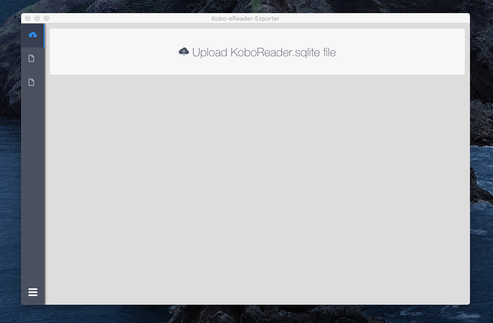
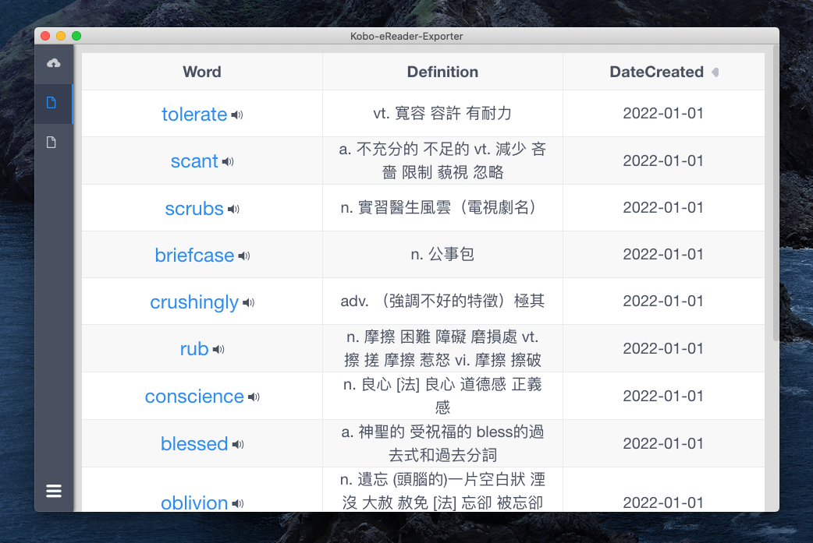
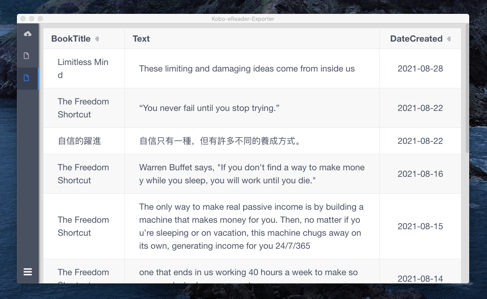

# Kobo eReader Exporter

<p align='left'>
  A GUI application that makes you export data from the Kobo eReader database., built on Electron and Vue.js.
</p>

<br>

<!-- downloads -->
<a href="https://github.com/benxuhuang/electron-vue-kobo-eReader-exporter/releases">

</a>
<!-- version -->
<a href="https://github.com/benxuhuang/electron-vue-kobo-eReader-exporter/releases">

</a>
<!-- platform -->
<a href="https://github.com/benxuhuang/electron-vue-kobo-eReader-exporter">

</a>
<a href="https://github.com/benxuhuang/electron-vue-kobo-eReader-exporter">

</a>

<br>
<br>

<br/>
<br/>
<br/>

<br>

## How to install and use the application

1. [Download and install the application](https://github.com/benxuhuang/electron-vue-kobo-eReader-exporter/releases)
2. Copy `KoboReader.sqlite` file from your eReader's drive: KOBOeReader > .kobo > KoboReader.sqlite to your computer
3. Open `electron-vue-kobo-eReader-exporter` application
4. Upload `KoboReader.sqlite` file

#### Note: Where do I find the KoboReader.sqlite file? 
#### 如何找到KoboReader.sqlite檔案?


`KoboReader.sqlite` is located on your Kobo device.
Connect your eReader to the computer, and open the folder ".kobo". 
There you should find your "KoboReader.sqlite" or "KoboReader" file 
(you will only see the extension .sqlite if you have that option enabled on your PC). 
If you can’t find your .kobo folder, that’s because it is hidden on your computer. 
Don’t worry! 
The following links will explain what you need to do to see the hidden folders and files:

- [Windows explanation](https://www.computerhope.com/issues/ch000516.htm)

- [MacOS explanation](https://appleinsider.com/articles/18/07/27/how-to-see-hidden-files-and-folders-in-macos)


## How to build

### Required

- [Nodejs](https://github.com/nodejs/node)
- [Electron](https://github.com/electron/electron)
- [Electron-vue](https://github.com/SimulatedGREG/electron-vue)
- [Node-sqlite3](https://github.com/mapbox/node-sqlite3)

### Build steps

- Clone the project via this Terminal command:

```sh
git clone https://github.com/benxuhuang/electron-vue-kobo-eReader-exporter
```

- Build steps

```bash

npm install

npm run dev

npm run build
```

